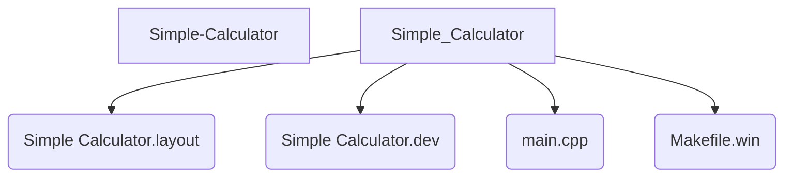

# Simple Calculator

## Overview
**Simple Calculator** is a **Easy** difficulty project implemented in **C++**.

## 📂 Project Structure
The following directory structure visualizes the file organization of this project.

```text
Simple-Calculator
├── Makefile.win
├── Simple Calculator.dev
├── Simple Calculator.layout
└── main.cpp

```

## 📐 Components
Visual representation of the primary files in this project:



## Features
- Implements core logic for Simple Calculator.
- Structured for scalability and readability.
- Demonstrates **C++** best practices for **Easy** complexity.

## How to Run
1. Navigate to the project directory:
   ```bash
   cd Simple-Calculator
   ```
2. Check the source code for entry points (e.g., `main` run command).
