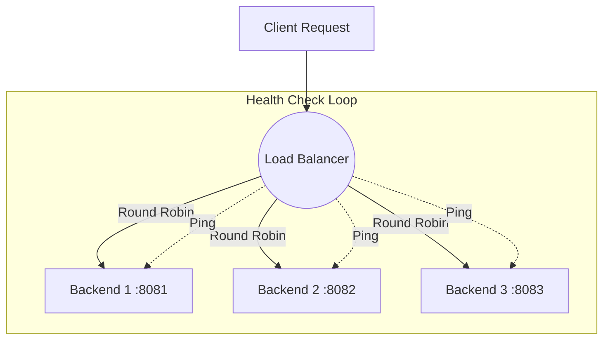

# Go Load Balancer

A production-ready **Layer 7 Load Balancer** implemented in Go, featuring traffic distribution and active health monitoring.

## Architecture

## Features
- **Round Robin Algorithm**: Distributes traffic evenly across healthy backends.
- **Active Health Checks**: Periodically pings backends to ensure availability.
- **Concurrency Safe**: Uses `sync/atomic` and `sync.Mutex` for thread-safe operations.
- **Fault Tolerance**: Automatically skips unhealthy upstream servers.

## Usage
1. Start mock backends (or use your own).
2. Run the balancer: `go run main.go`
3. Send requests to `http://localhost:8000`.
