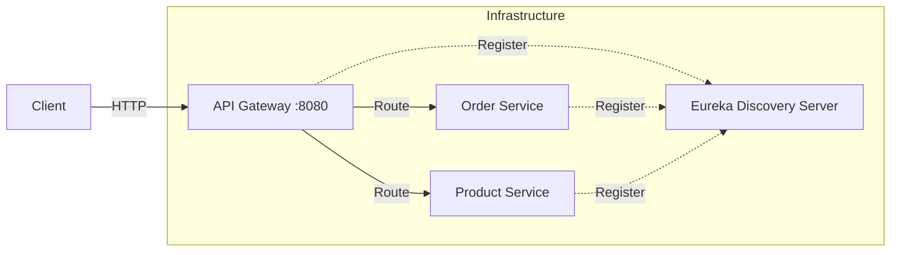

# Microservices Demo with Spring Boot

## Overview
A comprehensive microservices architecture designed to demonstrate scalable backend systems. This project serves as a reference implementation for **Service Discovery**, **API Gateway pattern**, and **Distributed Tracing**.

## Architecture

## Components
- **Discovery Service (Eureka)**: Registry for all microservices.
- **API Gateway (Spring Cloud Gateway)**: Unified entry point for external traffic.
- **Order Service**: Functional domain service for order processing.

## Tech Stack
- **Languages**: Java 17
- **Framework**: Spring Boot 3, Spring Cloud
- **Build Tool**: Maven
- **Infrastructure**: Docker

## Getting Started
1. Run `mvn clean install`
2. Start the Discovery Service first.
3. Start the API Gateway and Order Service.
