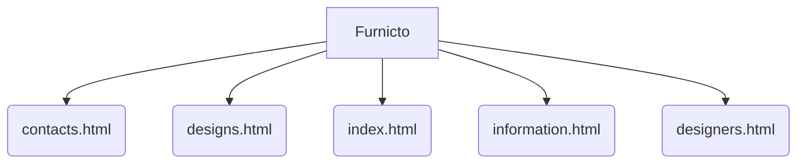

# Furnicto

## Overview
**Furnicto** is a **Hard** difficulty project implemented in **JavaScript**.

## 📂 Project Structure
The following directory structure visualizes the file organization of this project.

```text
Furnicto
├── contacts.html
├── css
│   ├── grid.css
│   ├── reset.css
│   └── style.css
├── designers.html
├── designs.html
├── images
│   ├── 1.jpg
│   ├── 2.jpg
│   ├── 25-495x371.jpg
│   ├── 3(1).jpg
│   ├── 3.jpg
│   ├── 4(1).jpg
│   ├── 4.jpg
│   ├── 47-495x346(1).jpg
│   ├── 47-495x346.jpg
│   ├── 5(1).jpg
│   ├── 5.jpg
│   ├── 98-495x412(1).jpg
│   ├── 98-495x412.jpg
│   ├── EP_Bath_Carn.jpg
│   ├── EP_Bath_ColeP.jpg
│   ├── EP_Bath_Winfrey.jpg
│   ├── EP_Kitchen_Carn.jpg
│   ├── FeaturedD_2.jpg
│   ├── bg-bot-tail.gif
│   ├── bg-top-shadow.png
│   ├── bg-top-tail.jpg
│   ├── bg-top-tail2.jpg
│   ├── bg-top.jpg
│   ├── button-tail.gif
│   ├── carousel-control.png
│   ├── carousel-li-bg.png
│   ├── edpkwood.jpg
│   ├── edporomantic.jpg
│   ├── footer-tail.gif
│   ├── gallery-img1.jpg
│   ├── gallery-img10.jpg
│   ├── gallery-img11.jpg
│   ├── gallery-img12.jpg
│   ├── gallery-img13.jpg
│   ├── gallery-img14.jpg
│   ├── gallery-img15.jpg
│   ├── gallery-img2.jpg
│   ├── gallery-img3.jpg
│   ├── gallery-img4.jpg
│   ├── gallery-img5.jpg
│   ├── gallery-img6.jpg
│   ├── gallery-img7.jpg
│   ├── gallery-img8.jpg
│   ├── gallery-img9.jpg
│   ├── marker-2.gif
│   ├── marker.png
│   ├── menu-a-tail.gif
│   ├── page1-img1.jpg
│   ├── page1-img2.jpg
│   ├── page2-img.jpg
│   ├── page2-img1.jpg
│   ├── page2-img2.jpg
│   ├── page3-img1.jpg
│   ├── page3-img2.jpg
│   ├── page3-img3.jpg
│   ├── page3-img4.jpg
│   ├── page3-img5.jpg
│   ├── page4-img1.jpg
│   ├── page4-img2.jpg
│   ├── page4-img3.jpg
│   ├── page4-img4.jpg
│   ├── page4-img5.jpg
│   ├── page4-img6.jpg
│   ├── page4-img7.jpg
│   ├── pic-1.gif
│   ├── pic-2.gif
│   ├── pic-3.gif
│   ├── pic-4.gif
│   ├── quote.png
│   ├── row1-top-tail.gif
│   ├── row2-tail.gif
│   ├── search-icon.gif
│   ├── search-input-tail.gif
│   ├── social-icons.png
│   ├── thumb-1.jpg
│   ├── thumb-2.jpg
│   ├── thumb-3.jpg
│   ├── thumb-4.jpg
│   ├── thumb-5.jpg
│   ├── thumb-6.jpg
│   ├── thumb.png
│   └── vj(1)
├── index.html
├── information.html
└── js
    ├── html5.js
    ├── jcarousellite_1.0.1.js
    ├── jquery-1.6.2.min.js
    ├── jquery.galleriffic.js
    └── jquery.opacityrollover.js

```

## 📐 Components
Visual representation of the primary files in this project:



## Features
- Implements core logic for Furnicto.
- Structured for scalability and readability.
- Demonstrates **JavaScript** best practices for **Hard** complexity.

## How to Run
1. Navigate to the project directory:
   ```bash
   cd Furnicto
   ```
2. Check the source code for entry points (e.g., `main` run command).
