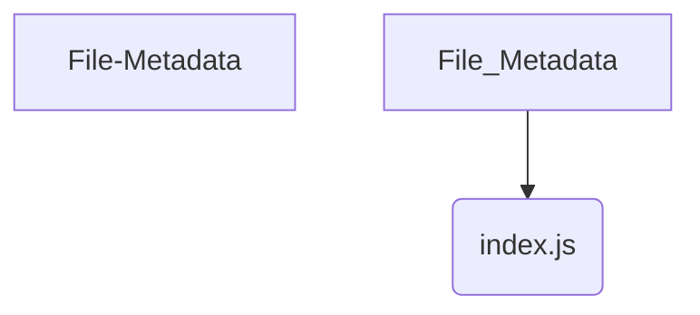

# File Metadata

## Overview
**File Metadata** is a **Easy** difficulty project implemented in **Node.js**.

## 📂 Project Structure
The following directory structure visualizes the file organization of this project.

```text
File-Metadata
└── index.js

```

## 📐 Components
Visual representation of the primary files in this project:



## Features
- Implements core logic for File Metadata.
- Structured for scalability and readability.
- Demonstrates **Node.js** best practices for **Easy** complexity.

## How to Run
1. Navigate to the project directory:
   ```bash
   cd File-Metadata
   ```
2. Check the source code for entry points (e.g., `main` run command).
