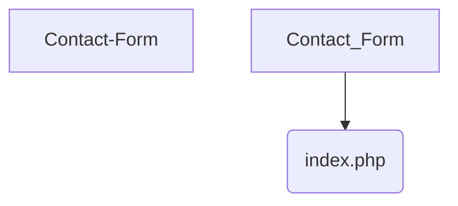

# Contact Form

## Overview
**Contact Form** is a **Easy** difficulty project implemented in **PHP-Laravel**.

## 📂 Project Structure
The following directory structure visualizes the file organization of this project.

```text
Contact-Form
└── index.php

```

## 📐 Components
Visual representation of the primary files in this project:



## Features
- Implements core logic for Contact Form.
- Structured for scalability and readability.
- Demonstrates **PHP-Laravel** best practices for **Easy** complexity.

## How to Run
1. Navigate to the project directory:
   ```bash
   cd Contact-Form
   ```
2. Check the source code for entry points (e.g., `main` run command).
