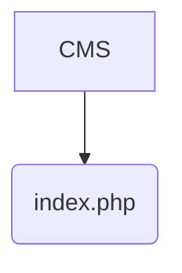

# CMS

## Overview
**CMS** is a **Expert** difficulty project implemented in **PHP-Laravel**.

## 📂 Project Structure
The following directory structure visualizes the file organization of this project.

```text
CMS
└── index.php

```

## 📐 Components
Visual representation of the primary files in this project:



## Features
- Implements core logic for CMS.
- Structured for scalability and readability.
- Demonstrates **PHP-Laravel** best practices for **Expert** complexity.

## How to Run
1. Navigate to the project directory:
   ```bash
   cd CMS
   ```
2. Check the source code for entry points (e.g., `main` run command).
