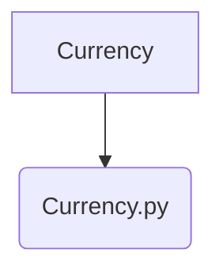

# Currency

## Overview
**Currency** is a **Easy** difficulty project implemented in **Python**.

## 📂 Project Structure
The following directory structure visualizes the file organization of this project.

```text
Currency
└── Currency.py

```

## 📐 Components
Visual representation of the primary files in this project:



## Features
- Implements core logic for Currency.
- Structured for scalability and readability.
- Demonstrates **Python** best practices for **Easy** complexity.

## How to Run
1. Navigate to the project directory:
   ```bash
   cd Currency
   ```
2. Check the source code for entry points (e.g., `main` run command).
