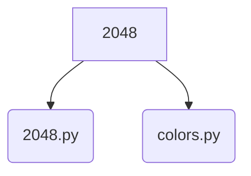

# 2048

## Overview
**2048** is a **Medium** difficulty project implemented in **Python**.

## 📂 Project Structure
The following directory structure visualizes the file organization of this project.

```text
2048
├── 2048.py
└── colors.py

```

## 📐 Components
Visual representation of the primary files in this project:



## Features
- Implements core logic for 2048.
- Structured for scalability and readability.
- Demonstrates **Python** best practices for **Medium** complexity.

## How to Run
1. Navigate to the project directory:
   ```bash
   cd 2048
   ```
2. Check the source code for entry points (e.g., `main` run command).
