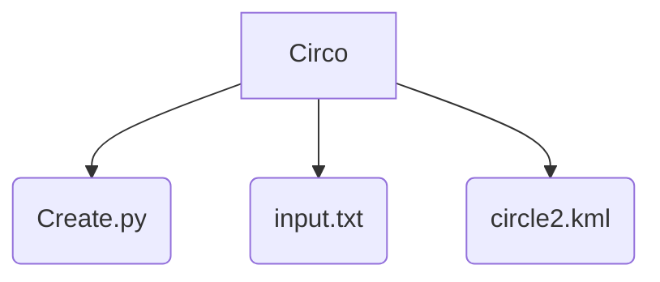

# Circo

## Overview
**Circo** is a **Medium** difficulty project implemented in **Python**.

## 📂 Project Structure
The following directory structure visualizes the file organization of this project.

```text
Circo
├── Create.py
├── circle2.kml
└── input.txt

```

## 📐 Components
Visual representation of the primary files in this project:



## Features
- Implements core logic for Circo.
- Structured for scalability and readability.
- Demonstrates **Python** best practices for **Medium** complexity.

## How to Run
1. Navigate to the project directory:
   ```bash
   cd Circo
   ```
2. Check the source code for entry points (e.g., `main` run command).
