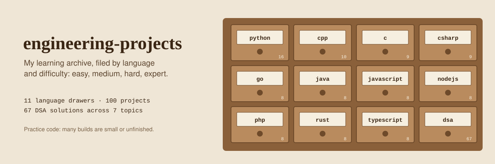

<div align="center">



  [](https://opensource.org/licenses/MIT)
  [](#jump-to-a-folder)
  [](#jump-to-a-folder)

  ### [Open the portfolio site](https://sudhanshu1402.github.io)

</div>


A personal learning archive of coding projects, sorted by language and difficulty tier. It's practice code: many builds are small or unfinished, and each tier README says what's there. Also carries a
single-page portfolio site (`index.html`) deployed to GitHub Pages.

## What is in here


Each language folder splits into `easy`, `medium`, `hard`, `expert`, with its own per-tier README.

## Jump to a folder

| Folder | Projects | Folder | Holds |
| :--- | ---: | :--- | :--- |
| [python](./python) | 16 | [dsa](./dsa) | 67 data structures and algorithms solutions, 7 topics |
| [cpp](./cpp) | 10 | [machine-learning-basics](./machine-learning-basics) | 4 intro machine learning builds |
| [c](./c) | 9 | [android](./android) | photo-manager, scientific-calculator |
| [csharp](./csharp) | 9 | [dbms](./dbms) | hospital-management-system, online-movie-booking-system |
| [go](./go) | 8 | [machine-learning](./machine-learning) | subconscious-robotics |
| [java](./java) | 8 | [learning-practice](./learning-practice) | scratch space |
| [javascript](./javascript) | 8 | | |
| [nodejs](./nodejs) | 8 | | |
| [php](./php) | 8 | | |
| [rust](./rust) | 8 | | |
| [typescript](./typescript) | 8 | | |

## A few of the bigger builds

| Project | Language | What it is |
| :--- | :--- | :--- |
| [load-balancer](./go/hard/load-balancer) | Go | Round-robin L7 load balancer, health-check polling |
| [async-executor](./rust/expert/async-executor) | Rust | Future executor, Waker-based scheduling |
| [kanban-board](./javascript/expert/kanban-board) | JavaScript | Drag-and-drop board, local persistence |
| [photo-manager](./java/hard/photo-manager) | Java | Android photo app on SQLite |
| [subconscious-robotics](./machine-learning/subconscious-robotics) | Python | Self-training framework, Hydra configs |

## Runnable checks

```bash
node scripts/make-readme-svg.mjs   # redraw both images above
node scripts/check-vault.mjs       # portfolio page still matches projects_data.js
```

The images are counted from `git ls-files` and `projects_data.js`. The generator throws rather
than draw a blank frame, and CI fails on drift.

Site, per-project run commands and the full layout: [docs/ARCHIVE.md](./docs/ARCHIVE.md).

---

<sub>More from [sudhanshu1402](https://github.com/sudhanshu1402): [keel](https://github.com/sudhanshu1402/keel) · [nocap](https://github.com/sudhanshu1402/nocap) · [receipts](https://github.com/sudhanshu1402/receipts) · [enterprise-auth-stack](https://github.com/sudhanshu1402/enterprise-auth-stack) · [distributed-queue-engine](https://github.com/sudhanshu1402/distributed-queue-engine) · [multi-region-mongo-patterns](https://github.com/sudhanshu1402/multi-region-mongo-patterns) · [otel-sdk-node](https://github.com/sudhanshu1402/otel-sdk-node) · [llm-assessment-pipeline](https://github.com/sudhanshu1402/llm-assessment-pipeline) · [system-design-portal](https://github.com/sudhanshu1402/system-design-portal). Portfolio: [sudhanshu1402.github.io](https://sudhanshu1402.github.io).</sub>

## License

[MIT](./LICENSE) - Sudhanshu Singh
