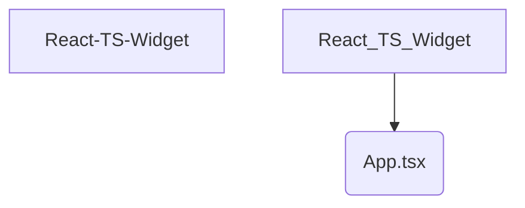

# React TS Widget

## Overview
**React TS Widget** is a **Medium** difficulty project implemented in **TypeScript**.

## 📂 Project Structure
The following directory structure visualizes the file organization of this project.

```text
React-TS-Widget
└── App.tsx

```

## 📐 Components
Visual representation of the primary files in this project:



## Features
- Implements core logic for React TS Widget.
- Structured for scalability and readability.
- Demonstrates **TypeScript** best practices for **Medium** complexity.

## How to Run
1. Navigate to the project directory:
   ```bash
   cd React-TS-Widget
   ```
2. Check the source code for entry points (e.g., `main` run command).
